# 🖥️ Active Directory Enterprise Simulation Lab
### Built on Microsoft Azure | Windows Server 2025 | nakelatech.local

> A hands-on enterprise simulation demonstrating Active Directory Domain Services deployment, identity management, Group Policy enforcement, and domain onboarding — built entirely in Microsoft Azure.

---

## 📋 Table of Contents

- [Overview](#overview)
- [Environment](#environment)
- [Video Walkthroughs](#video-walkthroughs)
- [Architecture Diagram](#architecture-diagram)
- [OU & Security Group Structure](#ou--security-group-structure)
- [Phase 1 – Infrastructure Deployment](#phase-1--infrastructure-deployment)
- [Phase 2 – Organizational Structure & RBAC](#phase-2--organizational-structure--rbac)
- [Phase 3 – Group Policy Administration](#phase-3--group-policy-administration)
- [Phase 4 – Domain Join & Validation](#phase-4--domain-join--validation)
- [PowerShell Scripts](#powershell-scripts)
- [Troubleshooting Log](#troubleshooting-log)
- [Skills Demonstrated](#skills-demonstrated)
- [Lessons Learned](#lessons-learned)

---

## Overview

**NakelaTech Solutions** is a simulated mid-size technology organization requiring centralized identity and access management across multiple business departments.

This lab simulates the role of a Systems Administrator responsible for:

- Deploying and configuring Active Directory Domain Services (AD DS)
- Designing a scalable Organizational Unit (OU) structure
- Implementing Role-Based Access Control (RBAC) via Security Groups
- Enforcing security policy through Group Policy Objects (GPOs)
- Onboarding a member server to the domain
- Validating authentication and policy application

---

## Environment

| Component | Details |
|---|---|
| **Platform** | Microsoft Azure |
| **Operating System** | Windows Server 2025 Datacenter |
| **Domain** | `nakelatech.local` |
| **Domain Controller** | DC01 |
| **Member Server** | WS01 |
| **Services** | AD DS, DNS, Group Policy Management (GPMC) |

---

## 🎬 Video Walkthroughs

Full Loom recordings for each phase of the lab:

| Phase | Topic | Link |
|---|---|---|
| Phase 1 | Installing AD, GPMC, and DC Setup | [▶ Watch on Loom](https://www.loom.com/share/4fd9795a975d40b291ecba41ae879f71) |
| Phase 2 | Continuation of DC installation, creating users and security groups | [▶ Watch on Loom](https://www.loom.com/share/a374e904d7e04b0fb6cba868cd9df2b1) 
|Phase 2 (pt.2) | phase 2 (pt 2 ) - Creating AD users and assigning group access | [▶ Watch on Loom](https://www.loom.com/share/de4b191822534ea69cff925771b6d8f7)
| Phase 3 | Implementing GPOs for AD Security Policies | [▶ Watch on Loom](https://www.loom.com/share/b7eaf6c57980414797e5c33967167b6e) |
| Phase 4 | Joining a Domain and Applying GPO | [▶ Watch on Loom](https://www.loom.com/share/473add193cb44b6e909a01682a7a0786) |

---

## Architecture Diagram

### Domain & Network Topology

```
                        ┌─────────────────────────────────────┐
                        │         Microsoft Azure              │
                        │                                      │
                        │   ┌──────────────────────────────┐  │
                        │   │     Virtual Network (VNet)   │  │
                        │   │                              │  │
                        │   │  ┌────────────────────────┐  │  │
                        │   │  │  DC01 (Domain Controller│  │  │
                        │   │  │  Windows Server 2025    │  │  │
                        │   │  │                         │  │  │
                        │   │  │  Roles:                 │  │  │
                        │   │  │  ├── AD DS              │  │  │
                        │   │  │  └── DNS Server         │  │  │
                        │   │  │                         │  │  │
                        │   │  │  Domain: nakelatech.local│ │  │
                        │   │  └────────────┬────────────┘  │  │
                        │   │               │               │  │
                        │   │        Domain Join            │  │
                        │   │               │               │  │
                        │   │  ┌────────────▼────────────┐  │  │
                        │   │  │  WS01 (Member Server)   │  │  │
                        │   │  │  Windows Server 2025    │  │  │
                        │   │  │  DNS → DC01             │  │  │
                        │   │  └─────────────────────────┘  │  │
                        │   └──────────────────────────────┘  │
                        └─────────────────────────────────────┘
```

---

### Active Directory Logical Structure

```
nakelatech.local  (Forest Root / Domain)
│
├── 📁 Executive
│     └── 👤 Nakela Johnson
│     └── 👤 Nakelaa Johnson
│
├── 📁 IT
│     └── 👤 Marcus Reed
│     └── 👤 Jordan Brooks
│
├── 📁 HumanResources
│     └── 👤 Sarah Mitchell
│     └── 👤 Jennifer Clark
│
├── 📁 Finance
│     └── 👤 Michael Thompson
│     └── 👤 Emily Davis
│
├── 📁 CustomerSupport
│
├── 📁 Operations
│
└── 📁 Workstations
      └── 🖥️ WS01
```

---

### Group Policy Object (GPO) Application Map

```
nakelatech.local
│
├── OU=IT ──────────────────────► [IT Security Policy GPO]
│                                     ├── Password Complexity: Enabled
│                                     ├── Minimum Password Length: 12 chars
│                                     ├── Machine Inactivity Limit: 15 min
│                                     └── Removable Storage: Restricted
│
└── OU=CustomerSupport ──────────► [Customer Support Policy GPO]
                                      ├── Control Panel: Restricted
                                      └── Command Prompt: Restricted
```

---

## OU & Security Group Structure

### Organizational Units

| OU Name | Purpose |
|---|---|
| Executive | Executive leadership accounts and policy scope |
| IT | IT administrator accounts and elevated policy |
| HumanResources | HR user accounts and access controls |
| Finance | Finance user accounts and access controls |
| CustomerSupport | Support staff accounts with restricted environment |
| Operations | Operations user accounts |
| Workstations | Domain-joined computer objects |

### Security Groups

| Group Name | Assigned To |
|---|---|
| `Executive_Users` | Executive OU users |
| `IT_Admins` | IT OU users |
| `HR_Users` | HumanResources OU users |
| `Finance_Users` | Finance OU users |
| `Support_Users` | CustomerSupport OU users |
| `Operations_Users` | Operations OU users |

> Security groups enforce Role-Based Access Control (RBAC) by assigning permissions at the group level rather than to individual user accounts — supporting the Principle of Least Privilege.

---

## Phase 1 – Infrastructure Deployment

**Goal:** Stand up the foundational Active Directory environment in Azure.

🎬 [Watch Phase 1 – Installing AD, GPMC, and DC Setup](https://www.loom.com/share/4fd9795a975d40b291ecba41ae879f71)

### Steps Performed

1. Deployed a Windows Server 2025 Datacenter VM in Microsoft Azure
2. Installed the **Active Directory Domain Services** role via Server Manager
3. Installed the **DNS Server** role
4. Promoted the server to **Domain Controller**
5. Created the Active Directory forest and domain: `nakelatech.local`

### Screenshots

### AD DS Installed
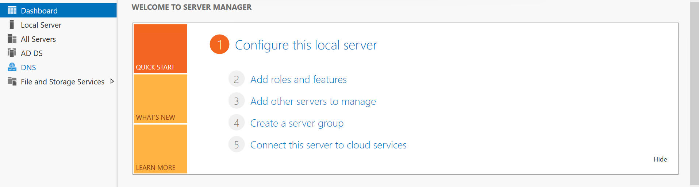

### Promote to Domain Controller
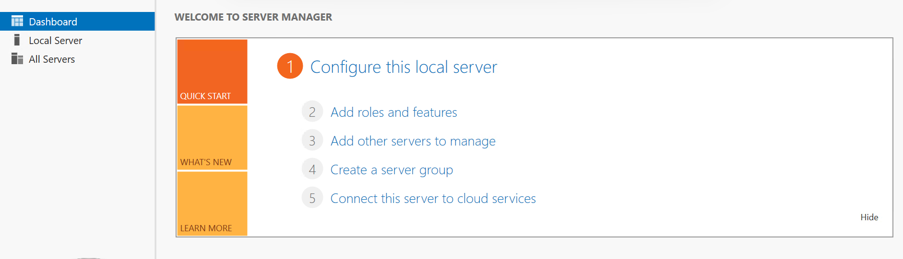

### Domain Creation
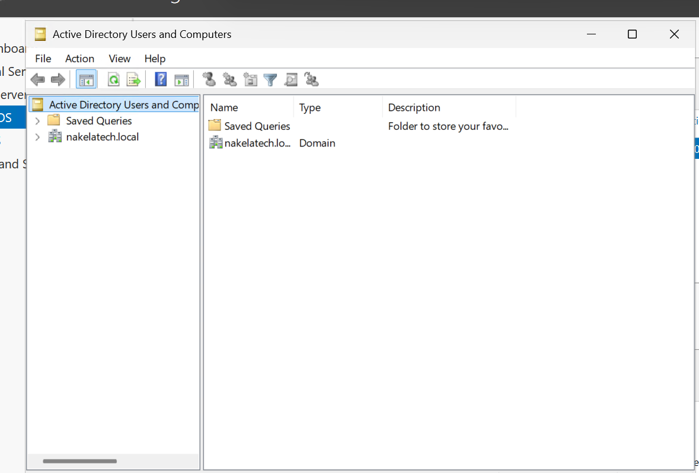

---

## Phase 2 – Organizational Structure & RBAC

**Goal:** Build a logical, scalable identity structure that mirrors a real business.

🎬 [Watch Phase 2 – Creating AD Users and Group Access](https://www.loom.com/share/070356146d4b49edb15960b7d9e26ca8) | [PHASE 2 PT 2 - Creating AD Users and Assigning Group Accesss▶ Watch on Loom](https://www.loom.com/share/de4b191822534ea69cff925771b6d8f7)

### Steps Performed

1. Created all Organizational Units via **Active Directory Users and Computers (ADUC)**
2. Created departmental **Security Groups**
3. Provisioned **user accounts** for each department
4. Assigned users to their respective Security Groups
5. Placed user objects within their corresponding OUs

### User Accounts Provisioned

| Department | Users |
|---|---|
| Executive | Nakela Johnson, Nakelaa Johnson |
| IT | Marcus Reed, Jordan Brooks |
| Human Resources | Sarah Mitchell, Jennifer Clark |
| Finance | Michael Thompson, Emily Davis |

### Screenshots

### OU Structure
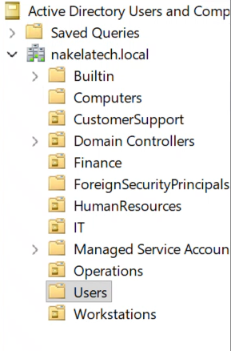

### Security Groups
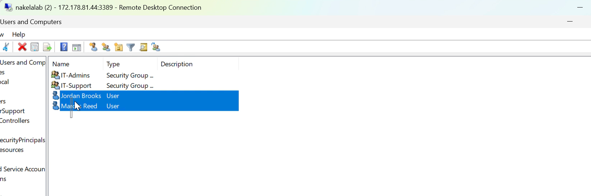

### Users Created
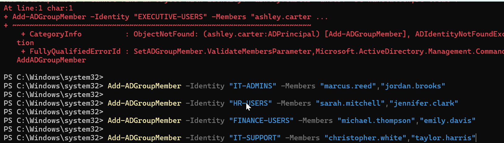

---

## Phase 3 – Group Policy Administration

**Goal:** Enforce security and compliance settings at the departmental level using GPOs.

🎬 [Watch Phase 3 – Implementing GPOs for AD Security Policies](https://www.loom.com/share/d568818d41ff4afeb17a5fc7b32b1e1d)

### IT Security Policy

**Linked to:** `OU=IT`

| Setting | Value |
|---|---|
| Password Complexity | Enabled |
| Minimum Password Length | 12 Characters |
| Machine Inactivity Limit | 15 Minutes |
| Removable Storage Access | Restricted |

### Customer Support Policy

**Linked to:** `OU=CustomerSupport`

| Setting | Value |
|---|---|
| Control Panel Access | Restricted |
| Command Prompt Access | Restricted |

### Screenshots

### IT Security Policy
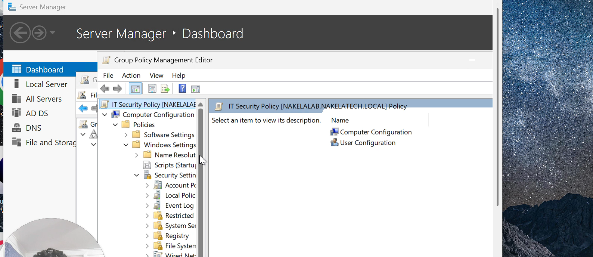

### Customer Support Policy
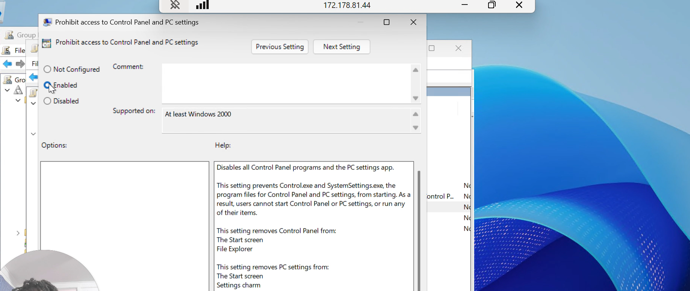

### Password Settings
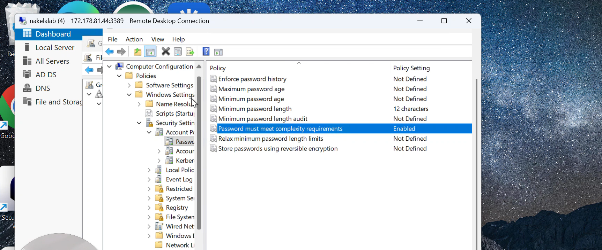

### USB Restrictions
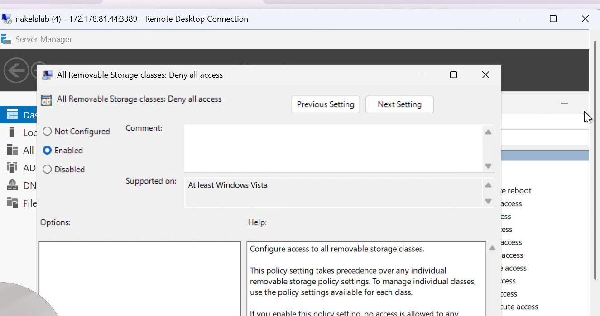

---

## Phase 4 – Domain Join & Validation

**Goal:** Onboard a member server to the domain and validate centralized authentication and policy delivery.

🎬 [Watch Phase 4 – Joining a Domain and Applying GPO](https://www.loom.com/share/473add193cb44b6e909a01682a7a0786)

### Steps Performed

1. Deployed member server **WS01** in Azure
2. Configured WS01's DNS to point to **DC01**
3. Verified DNS resolution:

```powershell
nslookup nakelatech.local
```

4. Verified Domain Controller discovery:

```powershell
nltest /dsgetdc:nakelatech.local
```

5. Joined WS01 to the `nakelatech.local` domain
6. Validated Group Policy processing:

```powershell
gpupdate /force
gpresult /r
```

### Screenshots

### WS01 Deployment
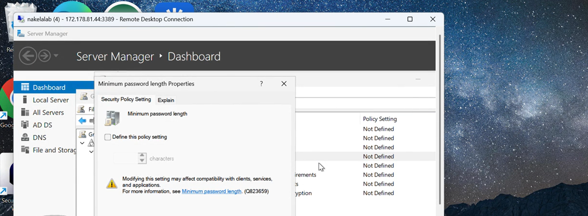

### DNS Configuration
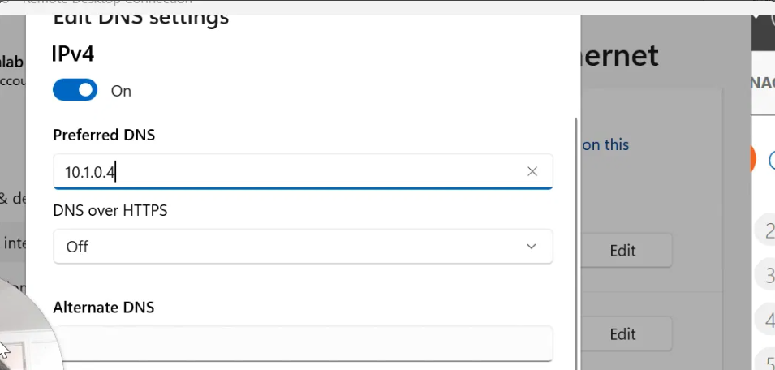

### nslookup Result
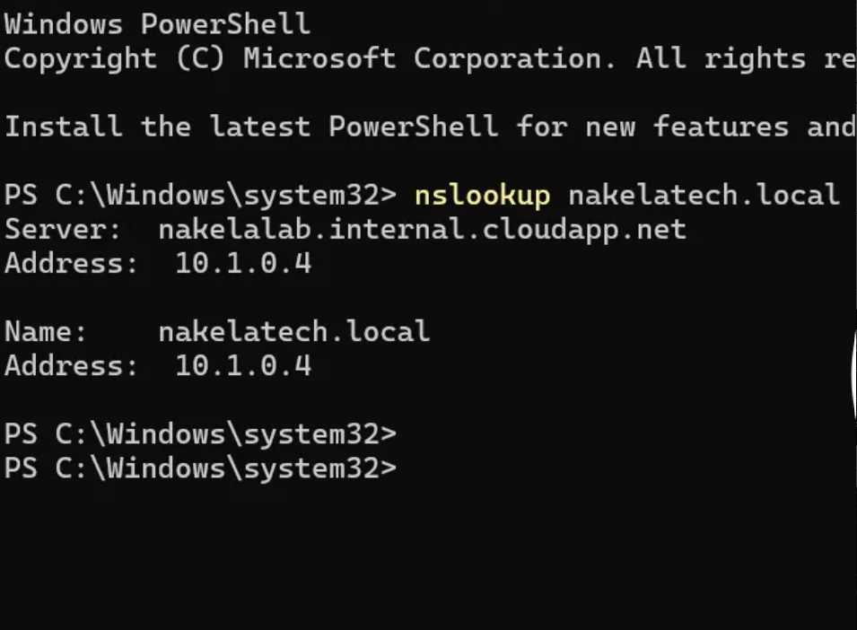

### nltest Result


### Domain Join Success
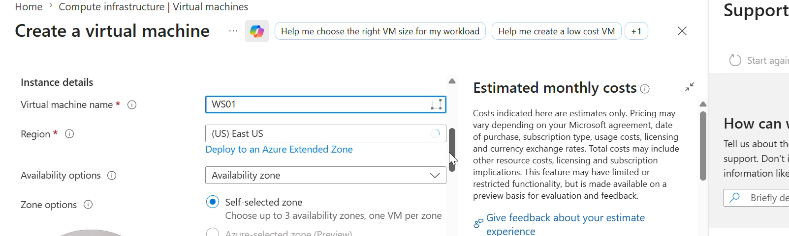

### Workstations OU
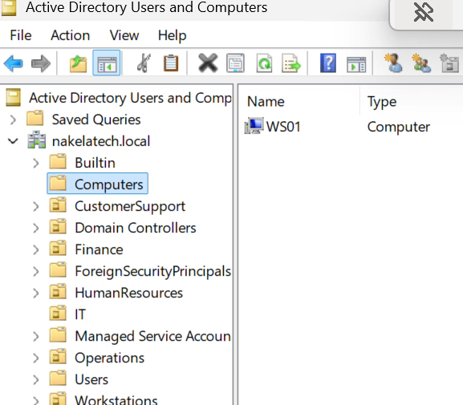

### gpupdate
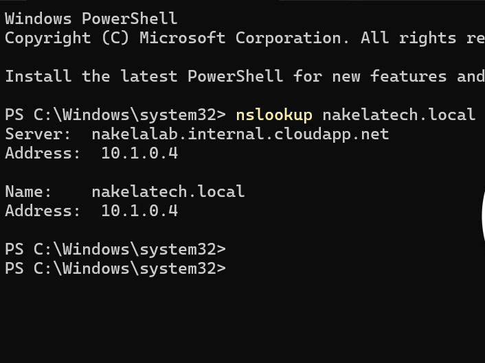

### gpresult
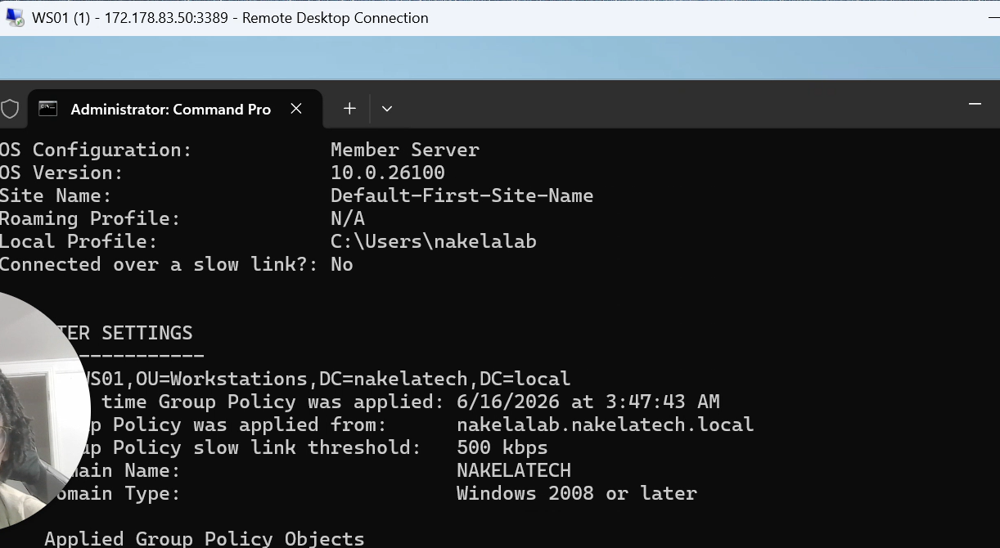

---

## PowerShell Scripts

All automation scripts used in this lab are located in the `/scripts` folder.

| Script | Description |
|---|---|
| [`Create-OUs.ps1`](scripts/Create-OUs.ps1) | Creates all Organizational Units in the domain |
| [`Create-SecurityGroups.ps1`](scripts/Create-SecurityGroups.ps1) | Creates all departmental security groups |
| [`Create-Users.ps1`](scripts/Create-Users.ps1) | Provisions all user accounts and places them in OUs |
| [`GroupMemberships.ps1`](scripts/GroupMemberships.ps1) | Assigns users to their respective security groups |

> Scripts are written for the `nakelatech.local` domain. Update the domain and OU paths if adapting for another environment.

---

## Troubleshooting Log

See [Troubleshooting.md](Troubleshooting.md) for full details on issues encountered and resolved during this lab.

### Summary

| Issue | Resolution |
|---|---|
| User creation errors | Corrected naming format and re-ran provisioning |
| Finance group naming issue | Renamed group to match convention (`Finance_Users`) |
| Domain join authentication failure | Switched to UPN format: `nakelalab@nakelatech.local` |
| Users removed from departments | Re-added via ADUC and verified group membership |
| Group membership failures | Resolved by running `Add-ADGroupMember` with correct identity parameters |

---

## Skills Demonstrated

- ✅ Active Directory Domain Services Deployment
- ✅ Domain Controller Promotion
- ✅ Organizational Unit Design & Management
- ✅ User Lifecycle Management
- ✅ Security Group Administration
- ✅ Role-Based Access Control (RBAC)
- ✅ Group Policy Object (GPO) Creation & Enforcement
- ✅ DNS Administration
- ✅ Domain Onboarding & Member Server Management
- ✅ Authentication Troubleshooting
- ✅ Policy Validation via PowerShell
- ✅ Enterprise Documentation

---

## Technologies Used

| Tool / Technology | Role in Lab |
|---|---|
| Microsoft Azure | Cloud infrastructure hosting |
| Windows Server 2025 Datacenter | OS for DC and member server |
| Active Directory Domain Services | Identity and authentication |
| DNS Server | Name resolution for domain |
| Group Policy Management Console | GPO creation and linking |
| Active Directory Users and Computers | OU, user, and group management |
| PowerShell | Automation and verification |

---

## Lessons Learned

1. **DNS is the backbone of Active Directory.** Every domain join, authentication attempt, and DC discovery depends on DNS resolving correctly. Misconfigured DNS is the #1 cause of domain join failures.
2. **Installation vs. Promotion are separate steps.** Installing the AD DS role does not make a server a Domain Controller — promotion is required.
3. **GPOs apply based on OU scope.** A GPO linked at the OU level affects only objects within that OU. Placement and inheritance both matter.
4. **UPN format vs. NetBIOS format matters for authentication.** When `DOMAIN\username` fails, try `username@domain.local` — especially in Azure-hosted environments.
5. **Validation is not optional.** `gpresult /r` and `nltest` are essential tools for confirming the environment is working as expected.

---

## 📁 Repository Structure

```
active-directory-enterprise-lab/
│
├── README.md
├── Troubleshooting.md
│
├── scripts/
│   ├── Create-OUs.ps1
│   ├── Create-SecurityGroups.ps1
│   ├── Create-Users.ps1
│   └── GroupMemberships.ps1
│
└── screenshots/
    ├── phase1/
    │   ├── 01-adds-installed.png
    │   ├── 02-promote-to-dc.png
    │   └── 03-domain-creation.png
    ├── phase2/
    │   ├── 01-ou-structure.png
    │   ├── 02-security-groups.png
    │   └── 03-users-created.png
    ├── phase3/
    │   ├── 01-it-security-policy.png
    │   ├── 02-customer-support-policy.png
    │   ├── 03-password-settings.png
    │   └── 04-usb-restrictions.png
    └── phase4/
        ├── 01-ws01-deployment.png
        ├── 02-dns-configuration.png
        ├── 03-nslookup.png
        ├── 04-nltest.png
        ├── 05-domain-join-success.png
        ├── 06-workstations-ou.png
        ├── 07-gpupdate.png
        └── 08-gpresult.png
```

---

*Lab completed by Nakela Johnson | nakelatech.local | Azure | Windows Server 2025*
